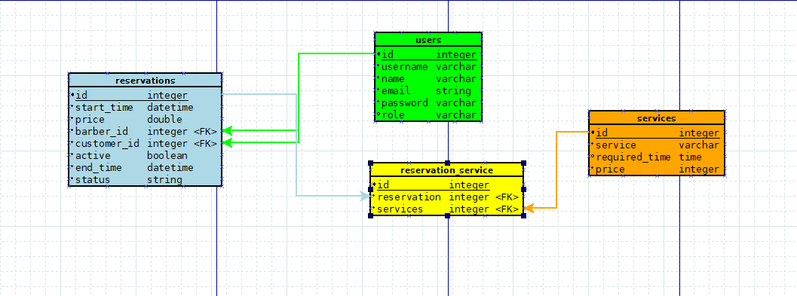

# Backend Dokumentáció

## Telepítés:
composer install

php artisan migrate

php artisan DB:seed

php artisan serve

## Fájlok:

### Események
App/Events/ReservationMade.php (Időpont lefoglalásakor indul ReservationController-ben, SendReservationEmail-nek jelez)

### -Kontrollerek
App/Http/Controllers/AdminController.php (Admin eseményeket kezel (pl.: Regisztráció, Jogkörök kezelése))

App/Http/Controllers/Controller.php (Minden kontroller ezt az osztályt örökli)

App/Http/Controllers/ReservationController.php (Foglalással kapcsolatos eseményeket kezeli)

App/Http/Controllers/ServiceController.php (Szolgáltatásokkal kapcsolatos eseményeket kezeli)

App/Http/Controllers/UserController.php (Felhasználókkal kapcsolatos eseményeket kezeli)

### -Middleware-ek
App/Http/Middleware/AdminMiddleware.php (Felhasználó jogköre alapján engedélyez/tilt végpontokat)

### -Kérések
App/Http/Requests/LoginRequest.php (Bejelentkezés formai követelményei)

App/Http/Requests/RegisterRequest.php (Regisztráció formai követelményei)

App/Http/Requests/ReservationRequest.php (Foglalás formai követelményei)

App/Http/Requests/ServiceRequest.php (Szolgáltatás formai követelményei)

### Listener-ek
App/Listeners/SendReservationEmail.php (ReservationMade eseményt vár, ReservationMadeMail küldését kezdeményezi)

### -E-mail-ek
App/Mail/RegisterMail.php (Sikeres regisztráció esetén küldött e-mail)

App/Mail/ReservationMadeMail.php (Sikeres foglalás esetén küldött e-mail)

### -Modellek
App/Models/Reservation.php (Foglalás modelje)

App/Models/Service.php (Szolgáltatás modelje)

App/Models/User.php (Felhasználó modelje)

### -Szolgáltatások
App/Services/AbilityService.php (Jogköröket kezelő szolgáltatás)

App/Services/RegisterService.php (Regisztrációt kezelő szolgáltatás)

App/Services/TokenService.php (Token-eket kezelő szolgáltatás)

### -Trait-ek
App/Traits/ResponseTrait.php (Szabványos válaszok küldését kezelő trait)

### -Seeder-ek
Database/Seeders/DatabaseSeeder.php (Adatbázist feltöltő seeder, meghívja a többi seeder-t)

Database/Seeders/ReservationSeeder.php (Reservation.sql alapján) (Alapértelmezett foglalások seeder-e)

Database/Seeders/ServiceSeeder.php (Service.sql alapján) (Alapértelmezett szolgáltatások seeder-e)

Database/Seeders/UserSeeder.php (Alapértelmezett felhasználók seeder-e)

### -Adatbázis
Database/database.sqlite

### -Nézetek
Resources/views/emails/registered.blade.php (Regisztációs e-mail tartalma)

Resources/views/emails/reserved.blade.php (Sikeres foglaláskori e-mail tartalma)

## Táblák:

|Tábla|Mező|Típus|Idegen Kulcs|
|-----|----|-----|------------|
|Users|id|integer|-|
|Users|username|varchar|-|
|Users|name|varchar|-|
|Users|email|string|-|
|Users|password|varchar|-|
|Users|role|varchar|-|
|Reservations|id|integer|-|
|Reservations|start_time|datetime|-|
|Reservations|price|double|-|
|Reservations|barber_id|integer|users->id|
|Reservations|customer_id|integer|users->id|
|Reservations|active|boolean|-|
|Reservations|end_time|datetime|-|
|Reservations|status|string|-|
|Reservation_service|id|integer|-|
|Reservation_service|reservation|integer|reservations->id|
|Reservation_service|services|integer|services->id|
|Services|id|integer|-|
|Services|service|varchar|-|
|Services|required_time|time|-|
|Services|price|integer|-|

## Képes Adatbázis Terv:

## Alapértelmezett Adatok:

### -Users Tábla
|Id|Username|Name|Email|Password|Role|
|--|--------|----|-----|--------|----|
|1|User1|Felhasználó Ferdinánd|Ferdinánd@email.lan|Aa123!|super-admin|
|2|User2|Felhasználó Fülöp|Fülöp@email.lan|Aa123!|admin|
|3|User3|Felhasználó Feri|Feri@email.lan|Aa123!|barber|
|4|User4|Felhasználó Franciska|Franciska@email.lan|Aa123!|user|
|5|User5|Felhasználó Fred|Fred@email.lan|Aa123!|inactive|
|6|User6|Felhasználó Fickó|Ficko@email.lan|Aa123!|barber|

### -Reservations Tábla
|Id|Start Time|Price|Barber Id|Customer Id|Active|End Time|Status|
|--|----------|-----|---------|-----------|------|--------|------|
|1|2030-01-01 00:00:01|1000.0|3|1|true|2030-01-01 00:23:59|upcoming|
|2|1999-01-01 00:00:01|5000.0|3|2|false|1999-01-01 00:23:59|complete|
|3|2004-01-01 00:00:01|300.0|3|4|false|2004-01-01 00:23:59|cancelled|
|4|1865-01-01 00:00:01|10.0|3|5|false|1995-01-01 00:23:59|invalid|

### -Services Tábla
|Id|Service|Required Time|Price|
|--|-------|-------------|-----|
|1|Haj Vágás|00:30:00|200|
|2|Haj Festés|00:45:00|500|
|3|Borotválás|00:20:00|1000|
|4|Szabadnap|13:00:00|0|

## Végpontok:

|Tábla|CRUD|Végpont|Leírás|Jogkör|
|-----|----|-------|------|------|
|UserController|-|-|-|-|
|Users|GET|/user|Összes felhasználó lekérése|Admin|
|Users|GET|/barber|Összes borbély lekérése|Admin|
|Users|POST|/login|Bejelentkezés|Felhasználó|
|Users|POST|/register|Regisztáció|Felhasználó|
|Users|POST|/logout|Kijelentkezés|Felhasználó|
|AdminController|-|-|-|-|
|Users|PUT|/revokeRole/{id}|Jogkör megvonása, felhasználó jogkörig|Admin|
|Users|PUT|/giveAdmin/{id}|Admin jogkör beállítása|Superadmin|
|Users|PUT|/giveBarber/{id}|Borbély jogkör beállítása|Admin|
|Users|PUT|/giveInactive/{id}|Inaktív jogkör beállítása|Admin|
|ServiceController|-|-|-|-|
|Services|GET|/service|Összes szolgáltatás lekérése|Felhasználó|
|Services|GET|/service/{id}|Egy szolgáltatás lekérése id alapján|Felhasználó|
|Services|POST|/service|Új szolgáltatás létrehozása|Felhasználó|
|Services|PUT|/service/{id}|Szolgáltatás változtatása id alapján|Felhasználó|
|Services|DELETE|/service/{id}|Szolgáltatás törlése id alapján|Felhasználó|
|ReservationController|-|-|-|-|
|Reservations|GET|/reservation|Összes foglalás lekérése|Felhasználó|
|Reservations|GET|/reservation/{id}|Foglalás lekérése id alapján|Felhasználó|
|Reservations|GET|/activeReservation|Összes aktív foglalás lekérése|Felhasználó|
|Reservations|GET|/barberReservation/{barber_id}|Egy borbély foglalásainak lekérése|Felhasználó|
|Reservations|GET|/customerReservation/{customer_id}|Egy vevő foglalásainak lekérése|Felhasználó|
|Reservations|GET|/barberActiveReservation/{barber_id}|Egy borbély aktív foglalásainak lekérése|Felhasználó|
|Reservations|GET|/upcomingReservation|Összes jövőbeli foglalás lekérése|Felhasználó|
|Reservations|GET|/completeReservation|Összes kész foglalás lekérése|Felhasználó|
|Reservations|POST|/reservation|Új foglalás létrehozása|Felhasználó|
|Reservations|PUT|/reservation/{id}|Foglalás változatása id alapján|Admin|
|Reservations|PUT|/completeReservation/{id}|Foglalás készként jelölése id alapján|Admin|
|Reservations|PUT|/cancelReservation/{id}|Foglalás lemondásának jelölése id alapján|Admin|
|Reservations|PUT|/invalidReservation/{id}|Foglalás érvénytelennek jelölése id alapján|Admin|
|Reservations|DELETE|/reservation/{id}|Foglalás törlése id alapján|Superadmin|

## Ismert Hibák:
Kontrollerek funkciói nem Service-ekből működnek

A nem autentikációval kapcsolatos adatok tárolására szolgáló Profile tábla hiányzik

Egy foglalásnak csak egy szolgáltatása lehet

ResponseTrait nincs bevezetve Request-ekben

Foglalás változtatásáról nem küld e-mail-t a backend

## E-mail adatok:
Cím: 2026barbershop@gmail.com
Jelszó: Barbershop2026

Kódok 2 lépcsős verifikációhoz:
9272 8470
4098 4594
2552 5388
4432 4926
9216 0188
0117 7182
8492 8846
8427 4159
5809 8323
6411 8994

SMTP Alkalmazás-jelszó: feas ksps nimf nxhv
